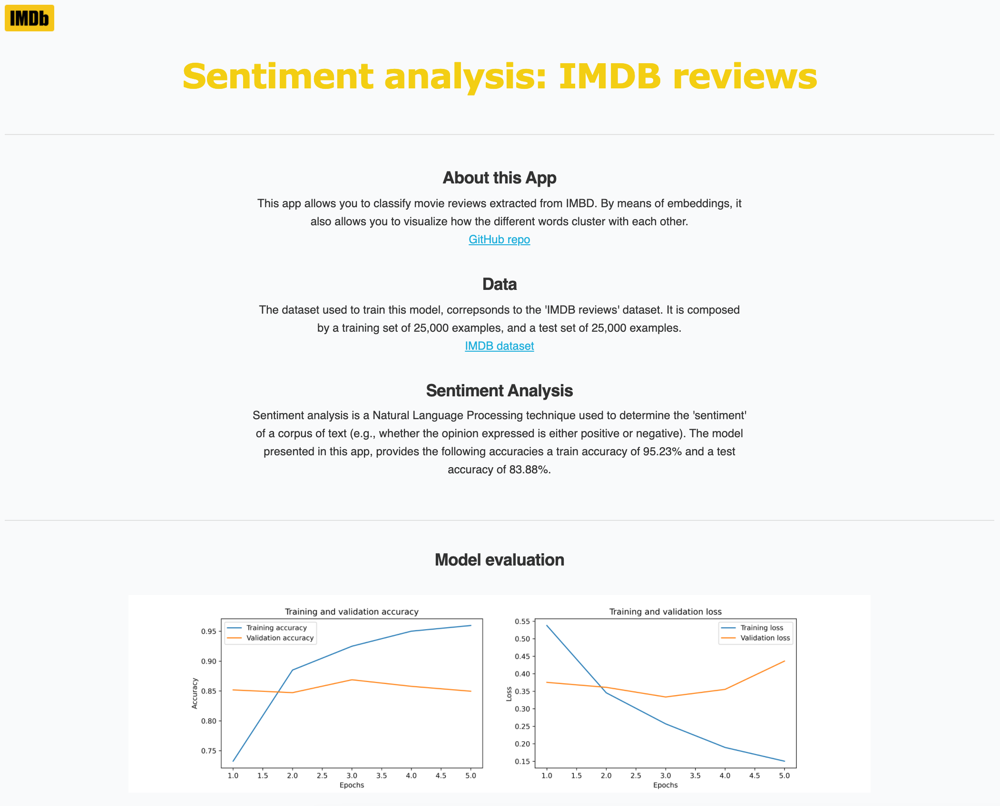

# Sentiment analysis: IMDB reviews

## About this app

This dash application allows you to classify movie reviews. By means of embeddings, it also allows you to visualise how the different words cluster with each other.




## Sentiment Analysis

Sentiment analysis is a *Natural Language Processing* technique used to determine the "sentiment" of a corpus of text (e.g., whether the opinion expressed is either positive or negative).

The model presented in this notebook, provides the following accuracies:

- Train accuracy: 95.23%
- Test accuracy: 83.88%

## Data

The dataset used to train the present model, corresponds to the [IMDB reviews](https://www.tensorflow.org/datasets/catalog/imdb_reviews) dataset.
It is composed by:

- Training set: 25,000 examples
- Test set: 25,000 examples.


## Requirements

* Python 3
* Tensorflow 2
* Dash

## How to run this app

Clone this repository and navigate to the main folder. To do so, open your Terminal (for MacOS/Linux) or your Command Prompt (for Windows) and run the following commands:
```
git clone https://github.com/guillermo-lahuerta/Sentiment-analysis.git
cd Sentiment-analysis/
```

I strongly suggest to create a virtual environment with Conda to manage dependencies and isolate projects. After installing [Miniconda](https://docs.conda.io/en/latest/miniconda.html), run the following commands to update the base conda packages:
```
conda update conda
conda update python
conda update --all
```

Then, create the new conda environment called *sentiment* to store all the dependencies related to this repo:
```
conda create -y --name sentiment python=3.8.5
conda activate sentiment
```

Now, create a Jupyter Notebook kernel for the new environment:
```
conda install -y ipykernel jupyter
conda install -c conda-forge jupyter_nbextensions_configurator
conda install -c conda-forge jupyter_contrib_nbextensions
python -m ipykernel install --user --name sentiment --display-name "sentiment"
```

Now, install all required packages:
```
pip install -r requirements.txt
```

### Install TensorFlow
It's time to install *TensorFlow*:

* If you don't have a NVIDIA graphics card, you should install the regular *TensorFlow* with the following command:
```
pip install tensorflow==2.4.0
```

* If you have a NVIDIA graphics card with CUDA architectures, you should consider installing *tensorflow-gpu* (instead of the regular *tensorflow*), to speed up your deep learning models. Rather than using *pip* or *conda* to try to figure out which version of TensorFlow you need, I recommend finding the exact "*.whl*" file from [TensorFlow](https://www.tensorflow.org/install/pip#package-location)’s site. Once you have the *url* of the corresponding TensorFlow version that you need, run the following command (substitute *<whl_url>* with the exact url):
```
pip install <whl_url>
```

### Run the app
To run the app locally, use these commands:
```
conda activate sentiment
cd app
python app.py
```

### Run the notebook
Also, you can run the jupyter notebook locally:
```
conda activate sentiment
jupyter notebook
```

## Resources

* [Dash](https://dash.plot.ly/)
* [TensorFlow](https://www.tensorflow.org/)
* [IMDB](https://www.imdb.com/)
